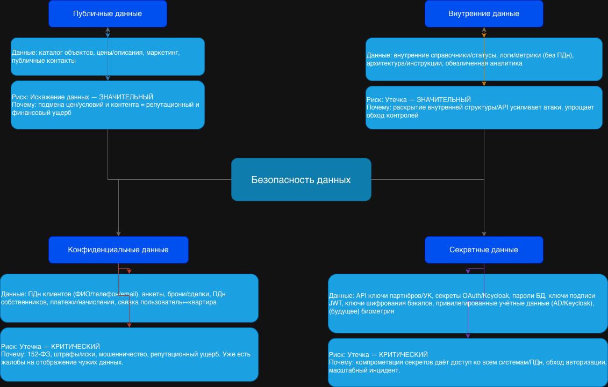

## Task1 — Проверочный лист по безопасности данных (ISO/IEC 27001/27002)

### 1) Классификация данных

#### A. Публичные данные (Public)

- Публичный каталог объектов недвижимости: адрес/район, планировки, цены (если публикуются), описания ЖК, маркетинговые материалы
- Публичные новости УК/застройщика, регламенты обслуживания (если размещены публично)
- Публичные контакты компании, справочные страницы витрин

**Риски и оценка:**
- **Искажение данных — значительный.**  
подмена цен/условий на витрине = репутационный ущерб, жалобы, финансовые потери (не обязательно утечка, а именно integrity)
- **Некачественные данные — значительный**  
пользователи принимают решения по данным каталога; ошибки ведут к жалобам, росту нагрузки на поддержку
- **Обесценивание данных — незначительный**  
публичность сама по себе снижает «ценность как секрет», но остаётся ценность актуальности

#### B. Внутренние данные (Internal)

- Внутренние справочники (не ПДн): статусы сделок/процессов, внутренние идентификаторы, технические метаданные
- Операционные логи/метрики/трейсы (если не содержат ПДн)
- Внутренние документы/архитектурные схемы/инструкции эксплуатации
- Агрегированные/обезличенные отчёты BI (если обезличивание действительно выполнено)

**Риски и оценка:**
- **Утечка — значительный**  
раскрывает внутреннюю структуру, API, интеграции (усиление атак), но обычно без прямого ущерба субъектам ПДн
- **Потеря — значительный**  
потеря логов/метрик/инструкций ухудшает расследование инцидентов и устойчивость
- **Некачественные данные — значительный**  
BI/управленческие решения, SLA и эксплуатация зависят от корректных внутренних данных

#### C. Конфиденциальные данные (Confidential)

- **ПДн клиентов**: ФИО, телефон, email (из витрины продаж), расширенная анкета для онлайн-сделки
- **ПДн собственников** (CRM собственников, tenant-core-db): данные лицевого счёта, начисления, история работ по ремонту (часто привязана к адресу/квартире → тоже ПДн)
- **Данные о бронях/сделках/платежах** (client-mart-db; интеграции с платёжной системой)
- **Связки «пользователь ↔ объект недвижимости/квартира»** (очень чувствительно из-за риска отображения чужих данных)
- Данные интеграций с УК (Поставщик ресурсов ЖКХ): счета, начисления, статусы

**Риски и оценка:**
- **Утечка — критический**  
  Почему: прямой риск нарушения 152‑ФЗ, репутационные потери, штрафы/исковые, риск мошенничества
- **Искажение — критический**  
  Почему: ошибки начислений/платежей/прав собственности → финансовый ущерб, юридические риски, массовые жалобы
- **Некачественные данные — критический**  
  Почему: бизнес жалуется, что в ЛК «иногда отображаются данные другого клиента» — это типичный симптом проблем разграничения доступа/консистентности/маппинга идентификаторов
- **Потеря — значительный/критический (в зависимости от типа)**  
  Почему: потеря данных сделок/платежей может быть критической; потеря части анкет — значительной

#### D. Секретные данные (Secret)

- Секреты доступа: ключи API партнёров/УК, токены сервис‑аккаунтов, секреты OAuth client, пароли БД, приватные ключи подписи JWT
- Криптографические ключи (KMS/HSM если есть), ключи шифрования бэкапов
- Административные учётные данные, привилегированные роли в Keycloak/AD
- (Если появится в будущем, особенно в 3 задании) **биометрические шаблоны/идентификаторы**, данные распознавания лиц/номеров авто — крайне чувствительно

**Риски и оценка:**
- **Утечка — критический**  
  Почему: компрометация секретов = компрометация всех систем, массовый доступ к ПДн, полный bypass авторизации
- **Потеря — критический**  
  Почему: потеря ключей шифрования = невозможность расшифровать данные/бэкапы; потеря ключей подписи = остановка IAM
- **Искажение — критический**  
  Почему: подмена ключей/конфигов/ACL → незаметная компрометация и длительное присутствие атакующего
