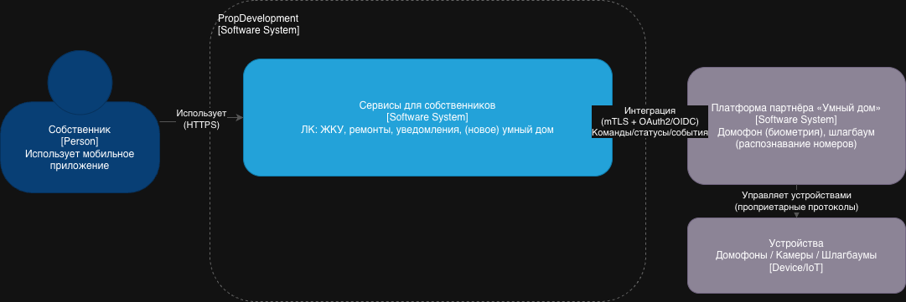
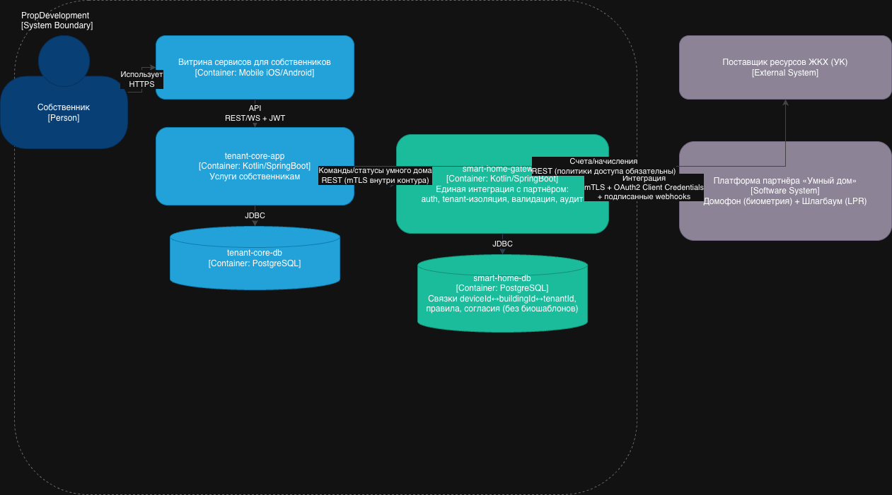

## Внешние интеграции («Умный дом»: домофон + шлагбаум)

Чтобы безопасно подключать партнёра и не размазывать интеграции по командам, предлагаю добавить внутри PropDevelopment отдельный контур:

- **smart-home-gateway** (новый контейнер): единая точка интеграции с внешней платформой «Умный дом»  
  Функции: mTLS/OAuth, валидация схем, rate limit, нормализация, аудит, tenant‑изоляция, проверка прав, токен‑обмен.
- **smart-home-db** (опционально): хранение *минимального* набора связок (buildingId/entranceId/deviceId, правила доступа, ссылки на согласия), без биометрических шаблонов.
- **tenant-core-app** остаётся «бизнес‑фасадом» для мобильного приложения собственников; все команды на устройства и получение статусов идут через gateway.

Ключевой принцип: **биометрию и распознавание номеров по возможности не хранить у PropDevelopment**, а держать у партнёра (PropDevelopment хранит только идентификаторы/ссылки/флаги согласия и аудит).

### 1) Диаграмма контекста

### 2) Обновлённая диаграмма контейнеров

### 3) Требования к внешним интеграциям (безопасность, authn/authz, взаимодействие)

#### 3.1. Требования к безопасности (Security)
1. **Единая точка интеграции**: все вызовы к партнёру только через `smart-home-gateway` (запрет прямых интеграций из мобильного приложения и из других сервисов).
2. **Шифрование трафика**:
  - Внешнее взаимодействие PropDevelopment ↔ партнёр: **TLS 1.2+**, предпочтительно **mTLS** (взаимная аутентификация сертификатами).
  - Внутреннее взаимодействие tenant-core ↔ smart-home-gateway: TLS/mTLS в зависимости от service mesh/инфраструктуры.
3. **Строгая валидация контрактов**:
  - JSON Schema/OpenAPI validation на gateway (deny-by-default для неизвестных полей).
  - Ограничение размеров payload, защита от JSON bombs.
4. **Tenant isolation (критично)**:
  - Любой запрос/событие обязаны содержать `tenantId/managementCompanyId/buildingId`.
  - Gateway **обязан** проверять соответствие: пользователь → квартира → дом/подъезд → устройство.
  - Недопустимо, чтобы партнёр мог запросить данные «без контекста» (проблема из описания про УК).
5. **Журналирование и аудит**:
  - Audit log для операций: `openDoor/openBarrier`, изменения прав доступа, привязка устройств, события распознавания.
  - Логи должны содержать: `who (userId)`, `what (operation)`, `where (deviceId/buildingId)`, `when`, `result`, `correlationId`.
6. **Rate limiting и защита от злоупотреблений**:
  - Лимиты на команды открытия (anti-abuse).
  - WAF/API gateway политики на внешнем периметре.
7. **Управление секретами**:
  - Секреты OAuth client, ключи webhook‑подписей, сертификаты mTLS — только в защищённом хранилище (Vault/KMS), ротация.
8. **Минимизация данных**:
  - Не передавать партнёру ПДн сверх необходимого (например, вместо ФИО — внутренний `subjectId`).
  - По возможности не хранить биометрию у PropDevelopment.
9. **Безопасность webhooks/событий**:
  - Подписанные события (HMAC/JWS) + проверка `timestamp` + защита от replay.
  - Allow‑list IP/сертификатов партнёра.
10. **Соответствие 152‑ФЗ**:
- Определить роли: оператор/обработчик, договор поручения обработки ПДн.
- Реестр ПДн, цели обработки, сроки хранения, права субъектов, локализация (если требуется по политике компании).

#### 3.2. Протоколы аутентификации и авторизации
**Пользователь (собственник) → PropDevelopment**
- **OIDC (OAuth 2.1)** для мобильного приложения:
  - Authorization Code + **PKCE**.
  - Access token JWT: `aud=tenant-core`, `scope=tenant:*`.
  - Refresh token с ограничениями и device binding (по возможности).

**PropDevelopment → Партнёр**
- OAuth 2.0/2.1 **Client Credentials** между `smart-home-gateway` и партнёром.
- Каждый токен должен быть ограничен:
  - по `scope` (например `smart_home:read`, `smart_home:command`),
  - по `tenant` (если партнёр поддерживает),
  - по `aud` (конкретный API партнёра).
- Для особо чувствительных операций (открытие двери/шлагбаума) — доп. контроль:
  - step-up (например, re-auth/biometric on device) или короткоживущие command tokens.

**Авторизация уровня объекта (обязательное требование)**
- Команда `openDoor(deviceId)` разрешена только если:
  - пользователь аутентифицирован,
  - в CRM/tenant-core подтверждена принадлежность к квартире/дому,
  - устройство привязано к дому/подъезду пользователя,
  - нет блокировок (долги/ограничения — если бизнес решит).

#### 3.3. Организация взаимодействия (как будут общаться системы)
**Команды (synchronous)**
1. Собственник в мобильном приложении нажимает «Открыть дверь/шлагбаум».
2. Mobile → `tenant-core-app` (REST/WS) с JWT.
3. `tenant-core-app` проверяет бизнес‑правила и ownership.
4. `tenant-core-app` → `smart-home-gateway` (REST, mTLS) запрос команды.
5. `smart-home-gateway`:
  - добавляет контекст tenant/building,
  - получает/кэширует access token партнёра (client credentials),
  - вызывает API партнёра,
  - пишет audit log.
6. Ответ возвращается пользователю.

**События (asynchronous, webhook)**
- Партнёр отправляет события (например «doorOpened», «faceRecognized», «barrierOpened», «plateRecognized») в endpoint gateway:
  - событие подписано (HMAC/JWS), содержит `eventId`, `timestamp`, `deviceId`, `buildingId`, `result`.
- `smart-home-gateway` валидирует подпись/анти‑replay, пишет audit log, затем:
  - либо пушит событие в `tenant-core-app` (REST),
  - либо публикует в очередь/шину (если появится Kafka/evt bus для этого домена).