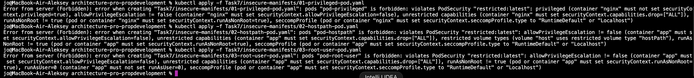
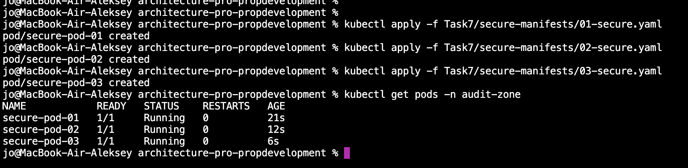

## Что сделано
1) Создан namespace `audit-zone` с PodSecurity `restricted` (enforce).
2) Подготовлены 3 небезопасных Pod-манифеста (privileged, hostPath, root UID).
3) Подготовлены 3 безопасных Pod-манифеста, соответствующих restricted.
4) Установлен OPA Gatekeeper и включены правила:
    - privileged запрещён
    - hostPath запрещён
    - runAsNonRoot=true обязательно
    - readOnlyRootFilesystem=true обязательно
    - runAsUser=0 запрещён

## Как проверить
1) Создать namespace:
    - `kubectl apply -f Task7/01-create-namespace.yaml`

2) Установить Gatekeeper:
    - `kubectl apply -f https://raw.githubusercontent.com/open-policy-agent/gatekeeper/v3.15.0/deploy/gatekeeper.yaml`
    - дождаться готовности: `kubectl rollout status deployment/gatekeeper-controller-manager -n gatekeeper-system`

3) Применить templates/constraints:
    - `kubectl apply -f Task7/gatekeeper/constraint-templates/`
    - `kubectl apply -f Task7/gatekeeper/constraints/`

4) Запустить проверки:
    - `cd Task7/verify && ./verify-admission.sh`
    - `./validate-security.sh`

Ожидаемое поведение:
- `Task7/insecure-manifests/*` отклоняются admission (PSA и/или Gatekeeper).
- `Task7/secure-manifests/*` успешно создаются.

## Выполнение

### 1) Namespace audit-zone с уровнем PodSecurity restricted

```bash 
kubectl apply -f Task7/01-create-namespace.yaml
```

Запускаем небезопасные скрипты:
```bash 
kubectl apply -f Task7/insecure-manifests/01-privileged-pod.yaml
kubectl apply -f Task7/insecure-manifests/02-hostpath-pod.yaml
kubectl apply -f Task7/insecure-manifests/03-root-user-pod.yaml
```

Ожидаемо: Error from server (Forbidden) с упоминанием PodSecurity/restricted (или конкретных нарушений):


### 2) манифесты под restricted
```bash 
kubectl apply -f Task7/secure-manifests/01-secure.yaml
kubectl apply -f Task7/secure-manifests/02-secure.yaml
kubectl apply -f Task7/secure-manifests/03-secure.yaml

kubectl get pods -n audit-zone
```

Все успешно прошло:




### 3) Ставим Gatekepper
```bash 
kubectl apply -f https://raw.githubusercontent.com/open-policy-agent/gatekeeper/v3.15.0/deploy/gatekeeper.yaml
```
Смотрим что все поднялось:
```bash 
jo@MacBook-Air-Aleksey architecture-pro-propdevelopment % kubectl get pods -n gatekeeper-system
NAME                                             READY   STATUS    RESTARTS      AGE
gatekeeper-audit-6c9dd6bd4b-jcbrz                1/1     Running   1 (10s ago)   20s
gatekeeper-controller-manager-67b76665df-bg6qq   1/1     Running   0             20s
gatekeeper-controller-manager-67b76665df-f6mh6   1/1     Running   0             20s
gatekeeper-controller-manager-67b76665df-hls72   1/1     Running   0             20s
```

Создаем скрипты, шаблон gatekeeper/constraint-templates/runasnonroot.yaml покрывает сразу два требования из задания:
* только runAsNonRoot: true
* обязательно readOnlyRootFilesystem: true
и дополнительно запрещает runAsUser: 0 (root).

применяем:
```bash
jo@MacBook-Air-Aleksey architecture-pro-propdevelopment % kubectl apply -f Task7/gatekeeper/constraint-templates/privileged.yaml
constrainttemplate.templates.gatekeeper.sh/k8sdisallowprivileged created
jo@MacBook-Air-Aleksey architecture-pro-propdevelopment % kubectl apply -f Task7/gatekeeper/constraint-templates/hostpath.yaml
constrainttemplate.templates.gatekeeper.sh/k8sdisallowhostpath created
jo@MacBook-Air-Aleksey architecture-pro-propdevelopment % kubectl apply -f Task7/gatekeeper/constraint-templates/runasnonroot.yaml
constrainttemplate.templates.gatekeeper.sh/k8srequiredsecuritycontext created
jo@MacBook-Air-Aleksey architecture-pro-propdevelopment % kubectl get crd | grep -i gatekeeper | head
assign.mutations.gatekeeper.sh                         2026-03-20T20:15:50Z
assignimage.mutations.gatekeeper.sh                    2026-03-20T20:15:50Z
assignmetadata.mutations.gatekeeper.sh                 2026-03-20T20:15:50Z
configs.config.gatekeeper.sh                           2026-03-20T20:15:51Z
constraintpodstatuses.status.gatekeeper.sh             2026-03-20T20:15:51Z
constrainttemplatepodstatuses.status.gatekeeper.sh     2026-03-20T20:15:51Z
constrainttemplates.templates.gatekeeper.sh            2026-03-20T20:15:51Z
expansiontemplate.expansion.gatekeeper.sh              2026-03-20T20:15:51Z
expansiontemplatepodstatuses.status.gatekeeper.sh      2026-03-20T20:15:51Z
k8sdisallowhostpath.constraints.gatekeeper.sh          2026-03-20T20:20:18Z
jo@MacBook-Air-Aleksey architecture-pro-propdevelopment % kubectl get crd | grep -E "k8sdisallowprivileged|k8sdisallowhostpath|k8srequiredsecuritycontext" -i
k8sdisallowhostpath.constraints.gatekeeper.sh          2026-03-20T20:20:18Z
k8sdisallowprivileged.constraints.gatekeeper.sh        2026-03-20T20:20:11Z
k8srequiredsecuritycontext.constraints.gatekeeper.sh   2026-03-20T20:20:25Z
```

### 4) 3 файла Constraints:
```bash
kubectl apply -f Task7/gatekeeper/constraints/privileged.yaml
kubectl apply -f Task7/gatekeeper/constraints/hostpath.yaml
kubectl apply -f Task7/gatekeeper/constraints/runasnonroot.yaml
```

### 5) Проверка
```bash
jo@MacBook-Air-Aleksey architecture-pro-propdevelopment % chmod +x Task7/verify/verify-admission.sh
jo@MacBook-Air-Aleksey architecture-pro-propdevelopment % chmod +x Task7/verify/validate-security.sh
jo@MacBook-Air-Aleksey architecture-pro-propdevelopment % cd Task7/verify
jo@MacBook-Air-Aleksey verify % ./verify-admission.sh
==> Create namespace (PSA restricted)
namespace/audit-zone unchanged

==> Try apply insecure manifests (should FAIL)
Error from server (Forbidden): error when creating "../insecure-manifests/01-privileged-pod.yaml": pods "pod-privileged" is forbidden: violates PodSecurity "restricted:latest": privileged (container "nginx" must not set securityContext.privileged=true), allowPrivilegeEscalation != false (container "nginx" must set securityContext.allowPrivilegeEscalation=false), unrestricted capabilities (container "nginx" must set securityContext.capabilities.drop=["ALL"]), runAsNonRoot != true (pod or container "nginx" must set securityContext.runAsNonRoot=true), seccompProfile (pod or container "nginx" must set securityContext.seccompProfile.type to "RuntimeDefault" or "Localhost")
exit=1
Error from server (Forbidden): error when creating "../insecure-manifests/02-hostpath-pod.yaml": pods "pod-hostpath" is forbidden: violates PodSecurity "restricted:latest": allowPrivilegeEscalation != false (container "app" must set securityContext.allowPrivilegeEscalation=false), unrestricted capabilities (container "app" must set securityContext.capabilities.drop=["ALL"]), restricted volume types (volume "host" uses restricted volume type "hostPath"), runAsNonRoot != true (pod or container "app" must set securityContext.runAsNonRoot=true), seccompProfile (pod or container "app" must set securityContext.seccompProfile.type to "RuntimeDefault" or "Localhost")
exit=1
Error from server (Forbidden): error when creating "../insecure-manifests/03-root-user-pod.yaml": pods "pod-root-user" is forbidden: violates PodSecurity "restricted:latest": allowPrivilegeEscalation != false (container "app" must set securityContext.allowPrivilegeEscalation=false), unrestricted capabilities (container "app" must set securityContext.capabilities.drop=["ALL"]), runAsNonRoot != true (pod or container "app" must set securityContext.runAsNonRoot=true), runAsUser=0 (container "app" must not set runAsUser=0), seccompProfile (pod or container "app" must set securityContext.seccompProfile.type to "RuntimeDefault" or "Localhost")
exit=1

==> Apply secure manifests (should PASS)
pod/secure-pod-01 unchanged
pod/secure-pod-02 unchanged
pod/secure-pod-03 unchanged

==> Pods in audit-zone
NAME            READY   STATUS    RESTARTS   AGE   IP           NODE       NOMINATED NODE   READINESS GATES
secure-pod-01   1/1     Running   0          10m   10.244.0.5   minikube   <none>           <none>
secure-pod-02   1/1     Running   0          10m   10.244.0.6   minikube   <none>           <none>
secure-pod-03   1/1     Running   0          10m   10.244.0.7   minikube   <none>           <none>
jo@MacBook-Air-Aleksey verify % ./validate-security.sh
==> Gatekeeper pods
NAME                                             READY   STATUS    RESTARTS        AGE
gatekeeper-audit-6c9dd6bd4b-jcbrz                1/1     Running   1 (8m27s ago)   8m37s
gatekeeper-controller-manager-67b76665df-bg6qq   1/1     Running   0               8m37s
gatekeeper-controller-manager-67b76665df-f6mh6   1/1     Running   0               8m37s
gatekeeper-controller-manager-67b76665df-hls72   1/1     Running   0               8m37s

==> Constraints
NAME                                                                            ENFORCEMENT-ACTION   TOTAL-VIOLATIONS
k8sdisallowhostpath.constraints.gatekeeper.sh/disallow-hostpath-in-audit-zone                        0

NAME                                                                                ENFORCEMENT-ACTION   TOTAL-VIOLATIONS
k8sdisallowprivileged.constraints.gatekeeper.sh/disallow-privileged-in-audit-zone                        0

NAME                                                                                                    ENFORCEMENT-ACTION   TOTAL-VIOLATIONS
k8srequiredsecuritycontext.constraints.gatekeeper.sh/require-nonroot-and-readonlyrootfs-in-audit-zone                        0

==> Describe constraints (violations if any)
Name:         disallow-privileged-in-audit-zone
Namespace:    
Labels:       <none>
Annotations:  <none>
API Version:  constraints.gatekeeper.sh/v1beta1
Kind:         K8sDisallowPrivileged
Metadata:
  Creation Timestamp:  2026-03-20T20:21:54Z
  Generation:          1
  Resource Version:    4012
  UID:                 66753955-9f56-4884-965c-57efd9447110
Spec:
  Match:
    Kinds:
      API Groups:
        
      Kinds:
        Pod
    Namespaces:
      audit-zone
Status:
  Audit Timestamp:  2026-03-20T20:24:04Z
  By Pod:
    Constraint UID:       66753955-9f56-4884-965c-57efd9447110
    Enforced:             true
    Id:                   gatekeeper-audit-6c9dd6bd4b-jcbrz
    Observed Generation:  1
    Operations:
      audit
      mutation-status
      status
    Constraint UID:       66753955-9f56-4884-965c-57efd9447110
    Enforced:             true
    Id:                   gatekeeper-controller-manager-67b76665df-bg6qq
    Observed Generation:  1
    Operations:
      mutation-webhook
      webhook
    Constraint UID:       66753955-9f56-4884-965c-57efd9447110
    Enforced:             true
    Id:                   gatekeeper-controller-manager-67b76665df-f6mh6
    Observed Generation:  1
    Operations:
      mutation-webhook
      webhook
    Constraint UID:       66753955-9f56-4884-965c-57efd9447110
    Enforced:             true
    Id:                   gatekeeper-controller-manager-67b76665df-hls72
    Observed Generation:  1
    Operations:
      mutation-webhook
      webhook
  Total Violations:  0
Events:              <none>
Name:         disallow-hostpath-in-audit-zone
Namespace:    
Labels:       <none>
Annotations:  <none>
API Version:  constraints.gatekeeper.sh/v1beta1
Kind:         K8sDisallowHostPath
Metadata:
  Creation Timestamp:  2026-03-20T20:22:00Z
  Generation:          1
  Resource Version:    4013
  UID:                 f702c458-29e1-4490-a18b-da77c628cd53
Spec:
  Match:
    Kinds:
      API Groups:
        
      Kinds:
        Pod
    Namespaces:
      audit-zone
Status:
  Audit Timestamp:  2026-03-20T20:24:04Z
  By Pod:
    Constraint UID:       f702c458-29e1-4490-a18b-da77c628cd53
    Enforced:             true
    Id:                   gatekeeper-audit-6c9dd6bd4b-jcbrz
    Observed Generation:  1
    Operations:
      audit
      mutation-status
      status
    Constraint UID:       f702c458-29e1-4490-a18b-da77c628cd53
    Enforced:             true
    Id:                   gatekeeper-controller-manager-67b76665df-bg6qq
    Observed Generation:  1
    Operations:
      mutation-webhook
      webhook
    Constraint UID:       f702c458-29e1-4490-a18b-da77c628cd53
    Enforced:             true
    Id:                   gatekeeper-controller-manager-67b76665df-f6mh6
    Observed Generation:  1
    Operations:
      mutation-webhook
      webhook
    Constraint UID:       f702c458-29e1-4490-a18b-da77c628cd53
    Enforced:             true
    Id:                   gatekeeper-controller-manager-67b76665df-hls72
    Observed Generation:  1
    Operations:
      mutation-webhook
      webhook
  Total Violations:  0
Events:              <none>
Name:         require-nonroot-and-readonlyrootfs-in-audit-zone
Namespace:    
Labels:       <none>
Annotations:  <none>
API Version:  constraints.gatekeeper.sh/v1beta1
Kind:         K8sRequiredSecurityContext
Metadata:
  Creation Timestamp:  2026-03-20T20:22:06Z
  Generation:          1
  Resource Version:    4011
  UID:                 7b24bca4-7818-4b12-9860-854d43a10e92
Spec:
  Match:
    Kinds:
      API Groups:
        
      Kinds:
        Pod
    Namespaces:
      audit-zone
Status:
  Audit Timestamp:  2026-03-20T20:24:04Z
  By Pod:
    Constraint UID:       7b24bca4-7818-4b12-9860-854d43a10e92
    Enforced:             true
    Id:                   gatekeeper-audit-6c9dd6bd4b-jcbrz
    Observed Generation:  1
    Operations:
      audit
      mutation-status
      status
    Constraint UID:       7b24bca4-7818-4b12-9860-854d43a10e92
    Enforced:             true
    Id:                   gatekeeper-controller-manager-67b76665df-bg6qq
    Observed Generation:  1
    Operations:
      mutation-webhook
      webhook
    Constraint UID:       7b24bca4-7818-4b12-9860-854d43a10e92
    Enforced:             true
    Id:                   gatekeeper-controller-manager-67b76665df-f6mh6
    Observed Generation:  1
    Operations:
      mutation-webhook
      webhook
    Constraint UID:       7b24bca4-7818-4b12-9860-854d43a10e92
    Enforced:             true
    Id:                   gatekeeper-controller-manager-67b76665df-hls72
    Observed Generation:  1
    Operations:
      mutation-webhook
      webhook
  Total Violations:  0
Events:              <none>

==> PSA labels on audit-zone
{"kubernetes.io/metadata.name":"audit-zone","pod-security.kubernetes.io/audit":"restricted","pod-security.kubernetes.io/audit-version":"latest","pod-security.kubernetes.io/enforce":"restricted","pod-security.kubernetes.io/enforce-version":"latest","pod-security.kubernetes.io/warn":"restricted","pod-security.kubernetes.io/warn-version":"latest"}
jo@MacBook-Air-Aleksey verify % 
```